# rez-rs Dataflow Diagrams

Publication cleanup on 2026-10-07 anonymizes deployment identifiers and local paths. The initial cleanup receipt is `dist/publication-verification.json`; the later registry stdlib/SRE replacement has its current package/source receipt in `dist/registry-transition-verification.json`; earlier migration/archive counts below describe their recorded snapshots. This cleanup does not repeat the full binary/runtime acceptance or activate an installed host.


**Current source reconciliation — 2026-10-07:** [Plan30](docs/plans/plan30.md#current-status) is reconciled against `24c97df` and the nine-crate workspace. Canonical bundle/copy/move, payload-cache execution, Rex globals/optionvars/action decoding, Pip sibling mapping/RECORD finalization, and prepared builder publication are implemented. Remaining work is named consumer/API/platform acceptance plus confirmed gaps such as package preprocessing execution. Saved workspace checks establish composite acceptance of 1,496 unique executed Rust tests, with separate doc/Python tests; the initial full campaign exited 101. These checks precede the later dependency refresh. The last packaging report is committed in `24c97df`, but tracked dist files were removed in the working tree during this review. Installed host SHA256 `f8a8e9b2…` does not match that packaged CLI; current deployment provenance is unverified. No build, runtime test, deployment, or recipe was launched for this documentation update. Earlier receipts below are historical snapshots; the preserved prior plan (historical snapshot in old.rez-rs) retains their full provenance.

## Historical checkpoints before workspace extraction

**Historical pre-workspace compiler, deployment and runtime acceptance:** the fresh offline locked release `--tests --no-run` gate passes in 364.621 seconds, exit 0, producing 17 test executables without compiler diagnostics; receipt `run_command_1791080037287_bcea6706`. Graph refresh `run_command_1791080037301_e8738344` completes with 26,688 nodes and 64,998 relationships. Native dry run and deployment both exit 0, receipt `run_command_1791080450013_49feebdf`; all 37 owned executable hashes match and the activation journal is absent. The runtime campaign's source/installed CLI SHA256 was `3d14c81c1bad3855dd4690f5c1490169079a6317dba1b13dd03c5a937221972b`; the final post-format packaging/deployment snapshot is recorded below. Full runtime `run_command_1791080479551_596b9738` passes all 17 targets: 1,484 passed, zero failed, six ignored, 97.181 seconds, exit 0. The separate private native run `run_command_1791080631555_4f6f2c74` passes CMake/Cargo/Go/Pip 4/0 in 30.97 seconds, including exact editable AST mapping and actual import after work drop; relative-CMake passes 1/0 in 0.30 seconds and wrapper rejection passes 1/0 in 0.50 seconds. Native aggregate: six passed, zero failed, 31.849 wrapper seconds, exit 0. The composite covers 1,490 unique executed tests, zero failures. Strict default-GUI release all-target Clippy with `-D warnings` passes in 45.921 seconds, exit 0, receipt `run_command_1791081052146_a2072bde`. Earlier Clippy attempts failed on needless borrows: library metadata line 103, 98.231 seconds (`run_command_1791080688242_92eacf4c`), then vcpkg test lines 191/198, 99.387 seconds (`run_command_1791080889418_e4b1c1ea`). Repairs remove only three semantically redundant references; no lint allowances were added. Workspace formatting runs in `run_command_1791080886210_183a9d16`; format check passes, receipt `run_command_1791080887855_c1a0119d`, exit 0. The 1,490-test runtime/native checkpoint predates formatting and these three borrow removals; no full runtime campaign follows them. Fresh offline single-job `bootstrap.py p` packaging passes in 97.11 seconds, including a 90.4-second release binary build without compiler diagnostics, receipt `run_command_1791081166811_a15692af`. Final graph refresh `run_command_1791081166824_81fe495a` completes with 26,688 nodes and 64,998 relationships. Artifact check `run_command_1791081348279_d35d4bc4` exits 0: 1,763 archive members pass CRC, complete byte-hash and current source-membership checks; Git/generated content is excluded, the package contains exactly metadata plus two payload files, and installer helpers match their canonical sources. Final native host deployment/smoke `run_command_1791081394433_252d6989` exits 0: all 37 owned hashes match, the journal is absent, and installed SHA256 is `9af14d9fce15dc2a738cc6e23091b4943d3ff529814e8112e59e0e62a53eab8e`. Version/deploy-help and isolated `rez-python -I` JSON/SSL/zlib smoke checks pass from an owned empty working directory without `PYTHONHOME`, `RUSTPYTHONHOME` or `PYTHONPATH`. The moved-bundle consumer passes 1/0 in 2.06 seconds against this fresh installed CLI; it repeats an existing test and does not increase the 1,490 distinct-test checkpoint. This artifact check precedes the final documentation edits: the root regenerates the ZIP with the canonical writer after document freeze and rechecks every byte/member. Exact final ZIP/source closure hashes and the final regeneration receipt belong in external `dist/verification.json`; source documents omit the circular ZIP hash. These Windows/private-consumer receipts do not establish complete Bootstrap117 installation, full Python API parity, native Unix/macOS consumers or actual vcpkg acceptance. Plan30 remains active; final archive regeneration/verification after document freeze and the wider queue remain pending.

**Historical failed runtime/native checkpoint and subsequent source repairs:** the 17-target campaign `run_command_1791079420741_14b53a87` finishes in 95.375 seconds, exit 101: 1,478 passed, five failed, six ignored. The five failures are path-expectation assertions; their source repairs touch three test files without production Rex changes. The private native run `run_command_1791079547292_be79e1e7` finishes in 35.064 seconds, exit 1: CMake/Cargo/Go pass 3/0, relative-CMake and wrapper-rejection checks each pass 1/0, while Pip editable import fails with `ModuleNotFoundError`; wheel and entrypoint checks pass. This native aggregate is five passed / one failed and does not establish acceptance. Probe `run_command_1791079673818_21820b8f` captures the editable finder `MAPPING` retaining a staging path because mixed Windows separators differ from setuptools' native backslashes. Frozen `pip_utils.rs` repairs use native component joins and `util::path_key` relocation across native, forward-slash and URI representations. The new Windows `editable_relocation_normalizes_mixed_native_and_verbatim_paths` source fixture covers raw `.pth`, quoted finder mappings, JSON/URI and four path forms. The native fixture now checks AST `MAPPING` against the exact original source and rejects staging markers before actual import after work drop. These changes subsequently receive the scoped compiler/runtime/native acceptance above; the failed receipts remain historical evidence. Plan30 remains active.

**Accepted compiler/deployment checkpoint before latest source repairs:** the single-job offline locked release `--tests --no-run` gate passes in 361.441 seconds, exit 0, producing 17 test executables without compiler warning/error diagnostics; receipt `run_command_1791078972811_a5f6213a`. C: has 411 GiB free at this checkpoint. The preceding attempt failed before execution with five E0433 diagnostics for `filetime`, receipt `run_command_1791078372240_dfaaadf6`; the dependency repair promotes existing locked 0.2.29 to normal dependencies without lock regeneration or download (verification `run_command_1791078723915_87a3fa59`, exit 0). Native deployment to `C:/rez3/Scripts/rez` passes, receipt `run_command_1791079381490_7f2dfd79`: dry-run JSON parses with exit 0, deployment exits 0, ownership schema 1 matches all 37 owned executable hashes, and the activation journal is absent. Source and installed CLI SHA256 are `286002db003e6c9628995435a83a2d8f7b4e059e0405f7b68513c8576216ab80`. The subsequent 17-target runtime and private native failures are recorded above; a current Clippy result remains pending. This installed CLI predates the latest Pip and fixture repairs. Planned ecosystem installations are private local CMake/Cargo/Go/Pip fixtures; no Bootstrap recipes have been installed. Dist remains `a4000e6…`. Plan30 remains active until its acceptance queue is resolved.

**Frozen publication and Pip source contracts:** legacy Python installation verifies unchanged original source bytes through the canonical loader, typed package identity and the complete `Package::to_data` snapshot before repository I/O. Verified bytes are atomically written inside the existing version lock and journaled publisher transaction; data-only YAML/TOML retain canonical serialization. Three regression sources cover helper/private-global preservation, source mutation during load and changed typed metadata; memory `a11cc56c-99d6-4bf4-bae5-9c1db2721775`. Pip SourceMap shares `util::path_key` for Windows normal/verbatim/drive-case identities and uses the selected Pip parser, interpreter policy and actual runner through graph discovery and final execution. Launcher preflight validates canonical Python AST or the selected distlib PE plus single `__main__.py` before launcher execution or staging; custom/unknown launchers are rejected. The host's 53,040-byte `pip.exe` is outside this verified capability; the native fixture selects verified `pip-script.py` with `config.pip.python`, leaving installed Pip unchanged. Private Python parser/runner probes pass (`run_command_1791077897880_8db3043e`, `run_command_1791078178971_d8290696`, and checkout-shadow rejection `run_command_1791078918464_2d5370ee`); these probes do not establish native-fixture acceptance; compilation and host deployment are accepted separately above. Memory `690f0b72-4031-4332-b997-730aa003f55c` records SourceMap/parser repairs. All implementation owners report source freeze; the fresh private declared-sibling/CMake/Pip fixtures pass through the scoped native receipt above.

**Accepted prior compiler/deployment checkpoint:** offline locked release `--tests --no-run` passes in 320.804 seconds, exit 0, without compiler warning/error diagnostics; receipt `run_command_1791075472274_b6877582`. The fresh CLI SHA256 is `2d9e9d6c6cf4bf5891af3cf737cd817f08493340a0d7ca946f64eed283651cf2`. Native deployment to `C:/rez3/Scripts/rez` exits 0 (`run_command_1791075926047_70664772`); the surrounding wrapper later exits 1 on post-deployment JSON parsing, a separate reporting failure. Independent verification (`run_command_1791075955325_6e00f388`) confirms all 37 owned executable hashes and an absent activation journal. The full offline release runtime campaign (`--tests --no-fail-fast`) completes in 90.968 seconds, exit 101: 17 targets, 1,461 passed, two failed, three ignored; receipt `run_command_1791075956813_832d1a19`. The two recorded failures are core `test_variant_new_hashed`, a stale assertion of the former true default, and CLI `test_cli_bundle_custom_definition_survives_relocation`, an actual Cmd root-path syntax defect. The core fixture now covers default named paths, explicit hashed opt-in and explicit false; the shared Rex path repair is source-frozen. Both repairs now have compiler and runtime acceptance through the current gate above. This earlier campaign remains a failed historical receipt. Source freeze is released for these scoped repairs. RECORD source review `36ca5478` finds no blockers, but is not runtime acceptance. Dist remains `a4000e6…`; no Bootstrap packages were installed.

**Later bounded checks:** independent receipt `run_command_1791076398568_fd64e4c6` verifies all 37 current owned executable hashes and all 37 previous executable backup hashes under `.rez-rs-backups/29c19679b6949339b37fdf2b7b60d0134cbf03e48051d72f3c433c175feb1c72`. The three explicitly executed ignored native Cargo/Go/Pip fixtures pass, zero failures, 20.81 test seconds / 20.833 wrapper seconds, exit 0; receipt `run_command_1791076114528_4c1fa697`. Coverage includes Cargo binary/cdylib/resources, publication and failed-rebuild preservation; Go multiple commands/resources; and local Pip PEP 517, wheel/entrypoint, editable imports after work drop and unchanged source. This separate run preserves the full campaign's two failures and three ignored results; that historical full campaign remains unsuccessful; the refreshed full gate is accepted above.

**Current source follow-ups:** `src/resolve/context.rs` now sends package root/base, post commands and explicit callbacks through the actual `ActionInterpreter::normalize_path` via optional interpreter input to `rex_package_data`; the Python binding retains those prepared strings. This repairs the forced slash conversion of native Cmd verbatim paths, demonstrated by receipts `run_command_1791076108044_98bfea5e` and `run_command_1791076166292_b235a48b`. A 16-case source regression covers four path forms across Cmd/PowerShell/Bash/Python. Memory `8be54016-0a75-41d3-b0e2-94baca758f65` records the source freeze; fresh compilation, deployment and the full runtime campaign are accepted above. Installed host `3d14c81c…` includes these edits; dist remains `a4000e6…`.

**Builder work boundary:** vcpkg source is frozen around shared effective ROOT/PATH command execution, owned install/buildtrees/packages roots, native prepared publication and response-file guards including arguments after `--`; no-install mode cannot publish. Actual vcpkg execution is unaccepted. The private CMake probe passes logical-prefix/physical-staging behavior and the absolute-install runtime guard, receipt `run_command_1791076639457_4c0f52f9`, exit 0 (memory `cbc2af98`). CMake production changes and Pip source-graph work are frozen and compile successfully; the private CMake and relative-CMake fixtures now pass above.

[Plan30](docs/plans/plan30.md) owns the active work queue. Diagrams describe inspected codepaths; historical counts and acceptance notes belong to their recorded checkpoints. Confirm current source before changing behavior.

## Active Rex Contract Workstream

Current implementation is in `crates/rez/resolve/src/context.rs` and `crates/rez/rex/src/wire.rs`. Globals and proxies share `_env_action`; the Python preamble formats namespaces and the native Rex manager handles environment expansion/query state. Strict action decoding is implemented. [Plan30](docs/plans/plan30.md#active-rex-contract-workstream) tracks remaining public API and native-consumer acceptance.

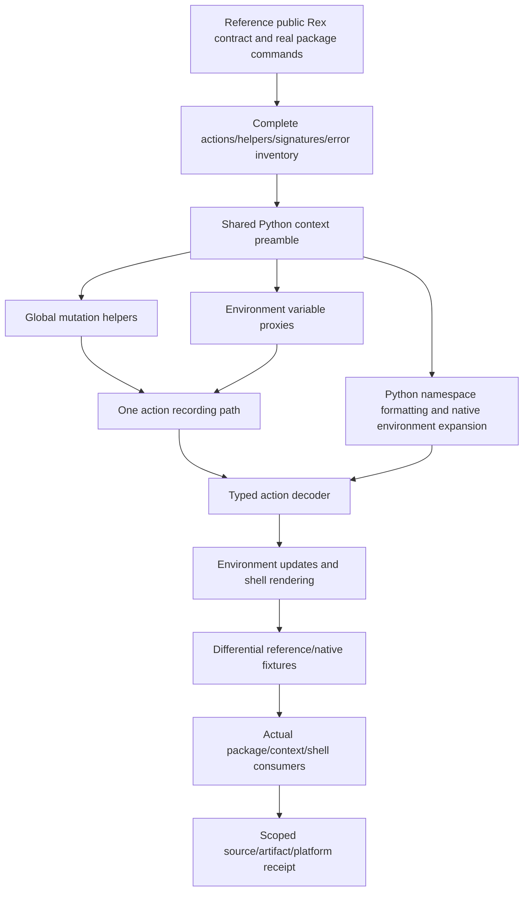

The user authorizes necessary scoped builds/tests for systemic full-port work. Synthetic platform fixtures do not establish native Linux/macOS execution; the broader queue remains open. The accepted Houdini artifact describes an earlier snapshot, not these subsequent edits.

## Implicit Requirements and Nullable Policy — Source Freeze

Scoped implementation accepted through the composite library/shell/Go receipts in [plan30](docs/plans/plan30.md): 1,406 unique tests. Campaign 5 itself exited 101; its repaired shell target and explicit Go run complete the composite gate. Source: `src/resolve/context.rs:60,353,2162`, `src/config.rs:681,1832`, `src/package/core.rs`, `src/pip/python.rs:66` and `src/builders/mod.rs:2310`.

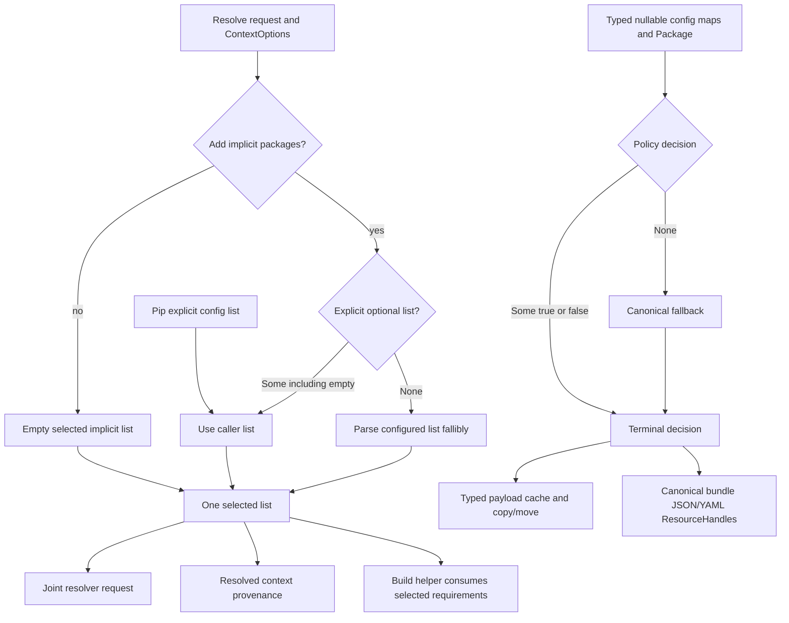

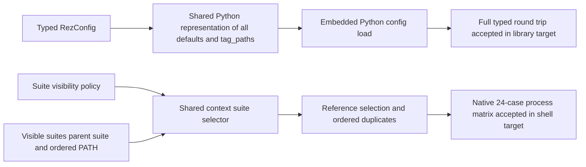

Null is the fallback signal; false remains a terminal cache-policy decision. Existing methods share optional config input for isolated callers. Raw cache force/local/device/cachable policy, cp/mv forwarding, and canonical bundle copying are implemented in the repository/resolve crates. Broader installed/native acceptance remains separate; see Plan30 A2.

## Canonical Bundle and Payload Cache — Current Source

`crates/rez/resolve/src/bundle_context.rs` uses the canonical context/provider/publisher path; flat metadata parsing is a historical diagnosis. Relative handles, selected nested payloads, shared `.rez/include`, actual destination indices, and no-clobber final staging are implemented.

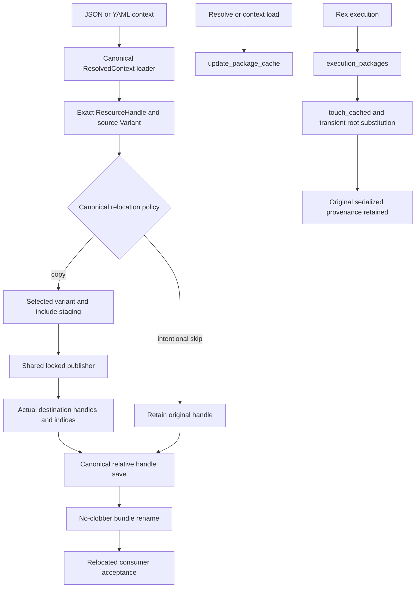

Current owners are the resolve context/bundle modules and repository provider/publisher/copy/cache modules. Typed cache policy and force plus execution integration exist. [Plan30 A2](docs/plans/plan30.md#a2--contexts-solver-repositories-and-services) retains concurrency, installed CLI, and native OS acceptance. Historical P1–P5 assignments are not a new work allocation.

## Acquisition and Shared Copy — Current Source

Shared copy lives in `crates/rez/foundation/src/filesystem.rs`; extraction/download live in `crates/rez/build-system/src/builders/`. Generated path authority, atomic file-leaf replacement, opaque-link merging, URL-scoped locked resume/checksum state, and bounded control filenames are implemented and included in saved workspace compiler/test scopes. Native Unix, link-stat parity, broader HTTP/archive consumers, and hostile ancestor-swap protection remain separate acceptance boundaries in Plan30 A5.

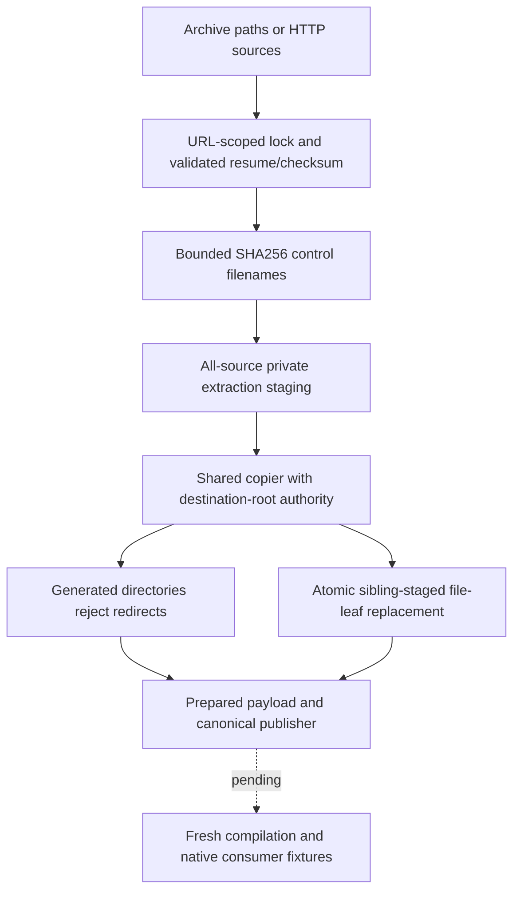

## Filesystem Identity and Installed CLI Gate — Source Pending

**Historical a4aa compiler/deployment and failed runtime checkpoint:** offline locked release `--tests --no-run` passed in 311.268 seconds, exit 0, receipt `run_command_1791073863883_0418514a`; independent full-stderr review (`run_command_1791074292295_82e5826a`) reads 19 lines without compiler warning/error diagnostics. Fresh executable: 38,543,872 bytes, SHA256 `a4aa797a9ed096dfd2b0c82f04134b00d2ecbb8fb4216ccc48dd60bdf2f50c9e`. Native dry run (`run_command_1791074157627_3f676f6c0`) preceded actual deployment to `C:/rez3/Scripts/rez` (`run_command_1791074181053_4e413f550`, 11.003 seconds). Independent verification (`run_command_1791074192067_65e7278a0`) accepts ownership schema 1 and hashes of 37 owned files: primary plus 36 aliases. All 37 previous owned hashes are backed up under `.rez-rs-backups/7837764f151732df71faba180cdee88c6d1930d2473f3b4183407661a3acfd64`; independent receipt `run_command_1791074292295_82e5826a`; activation journal is absent. The offline release runtime campaign (`--tests --no-fail-fast -- --test-threads=1`) completed in 177.129 seconds, exit 101: 17 targets, 1,438 passed, 22 failed, three ignored; library 1,223 passed / 15 failed. Runtime receipt `run_command_1791074245398_422f4e57`, independent counts `run_command_1791074482897_a1c36364`; private empty config/home disabled and `REZ_RS_TEST_BIN` selects the installed executable. This campaign is unsuccessful. Host `a4aa797…` was this accepted compiled/deployed snapshot. The current 2d9e9d6… checkpoint above supersedes its host/compiler status; neither checkpoint establishes complete runtime acceptance.

**Post-a4aa repair inventory:** CLI env now reuses canonical `FilesystemPackageProvider`; the duplicate provider's get-packages-only path lost provenance. Source-only repair: get_package_provider impact CRITICAL (one caller/five processes), receipt `run_command_1791074570738_9c1100da`; rustfmt receipt `run_command_1791074605893`. Publisher common-copy source fixes cover Windows canonical authority, native non-UTF8 paths, cross-volume stats and reparse handling; memory `1029b4a3`, no runtime acceptance. Independent actual CPython `DeveloperPackage.from_path` probes against both standard `_ref` and customized 1050 Rez show absent `hashed_variants` yields null and `platform-windows` subpath, each exit 0 (`run_command_1791074909494_78f5555d`). Rust's former default true is a real compatibility defect, not merely invalid fixtures. Source now shares `constants::DEFAULT_HASHED_VARIANTS = false` across RezConfig and Package defaults; explicit true remains supported. Config impact is CRITICAL (15 entries/six modules, receipt `run_command_1791075069795_4eafcb24`), Package impact HIGH (seven entries/three modules, `run_command_1791075134962_75ea692b`); root source readback/rustfmt passes (`run_command_1791075189234_f2d49255`). A correct six-case actual CPython matrix against both reference roots passes (`run_command_1791075042390_97a94646`): omitted/false use plain paths; true uses SHA1 `3027990398d6221553b5d4c4424128442bacfdb8`. Core regression and eight-file fixture repairs are source-authored, memory `88ee73b3`, with no refreshed runtime acceptance. Root cache fixtures use canonical cache.path; CLI copy --allow-empty and valid destination metadata move fixtures preserve payload/source visibility, rustfmt receipt `run_command_1791074960315_195edf9b`. The initial wrong-import probe failed (`run_command_1791074879813_138e1491`) before the verified API rerun. Worker fixture YAML wrapper/path corrections are scoped separately. Pip RECORD finalization follows one shared path; source review `36ca5478` finds no blockers. The later compile/deploy checkpoint above accepts compiler/host refresh, while refreshed runtime acceptance is pending. Dist is not refreshed. Dist remains `a4000e6…`; no Bootstrap packages were installed.

**Historical source-freeze and compiler-failure checkpoint:** all owners froze the native/Pip staged-payload source, including editable known-path mapping corrections. Root authored real local Pip regular/editable import-after-work-drop fixtures and owned local Cargo/Go fixtures; none has fresh runtime acceptance. The offline locked release compile-only repeat (`cargo test --offline --locked --release --tests --no-run`, one job) failed after 601.208 seconds, exit 101: sole compiler error E0433 at `src/builders/pip_utils.rs:21` references `which` without a root dependency. Receipt `run_command_1791071628884_c255a5e1-b66e-4f12-95b2-22e6789983c4`; the shared executable-lookup source repair is frozen at `0b9ab45a`, without adding a `which` dependency. No fresh tests ran. The following compile-only gate failed after 147.906 seconds, exit 101, E0599 at `src/cli/repo/cache.rs:222`: nonexistent `FilesystemPackageProvider::new`; receipt `run_command_1791072760194_88f1a8a6-ae4f-4bea-9dab-932cf52bda33`. Library compilation passed in that attempt, but all targets and tests did not. Root verified `from_paths(&[PathBuf])`, inventoried 34 references with one bad call, checked cmd_add LOW impact (one caller, receipt `run_command_1791073011482_05617b4b`) and source-repaired `from_paths(&paths)` with rustfmt. That retry failed after 3.037 seconds, E0061 at `tests/integration4_shell.rs:515`: the 24-case Suite fixture used the old one-argument `find_executable`; it now supplies `None`. Receipt `run_command_1791073049664_2d79e6ed-2b71-4c2e-9dee-e8f58205168b`. The next gate failed after 64.046 seconds with three library-test compiler errors: cache old copy helper (`src/package/cache.rs:2093`), repository `owner.file` access (`src/repository.rs:339`) and context tools key/type (`src/resolve/context.rs:4406`); receipt `run_command_1791073289096_bd8d8d26`. Source repairs use canonical copy, idempotent lock behavior and full tools tuple-key collision assertions; rustfmt exits 0, receipt `run_command_1791073863654_edfbe9ad`. That compile-only gate later passed; the current compiler/deployment receipt above supersedes its pending status. The failures below remain historical evidence. Force-refreshed graph has 26,605 nodes / 64,767 edges, 34,849 ms, receipt `run_command_1791071660304_11df7a8d`; degraded-edge warnings require direct source inventory. External relative inputs, stale wheel RECORD paths/hashes and Unix PATH case remain verified source follow-ups, not accepted implementation. At that historical checkpoint host deployment was pending; the current receipt above supersedes host status. Dist/Bootstrap acceptance remains separate.

The compile-only gate failed after 823.426 seconds, exit 101: `cargo test --offline --locked --release --tests --no-run`, receipt `run_command_1791068960820_35c4a9e4-ce41-4df0-b559-8831d41d3970`. The nested source Option at `tests/integration3_repo.rs:606` is source-repaired afterward; a successful repeat remains pending. Cargo/Go/Zig prepared-payload staging is a new source-only tranche; Python/Pip preparation continues. No host deployment, fresh dist or Bootstrap installation follows from this failed gate. Five CLI fixture sources now include worker prepared-config mapping and cache-root flags (`tests/cli_integration.rs:1352,1456,1541,1640,1775`). Worker startup registers the native CLI pointer before VM/config seeding and restores only prepared mapped system identity through existing `RAW_SYSTEM.mapped` (`src/config.rs:592-593`); it does not reload ambient files/env. Status loader closure repair at `src/status.rs:637-639` has source readback only. Copy package publication timestamps are independent of always-preserved payload/include filesystem times and regular-file/directory permissions; nested opaque-link stats and native Unix runtime behavior remain pending.

Inspected source: `src/platform.rs:139,144,209,1142,1159`, `tests/cli_integration.rs:11-14,1352,1456,1541,1640,1775`. These are source implementations/fixtures with fresh compilation and runtime acceptance pending; no native Unix result is claimed.

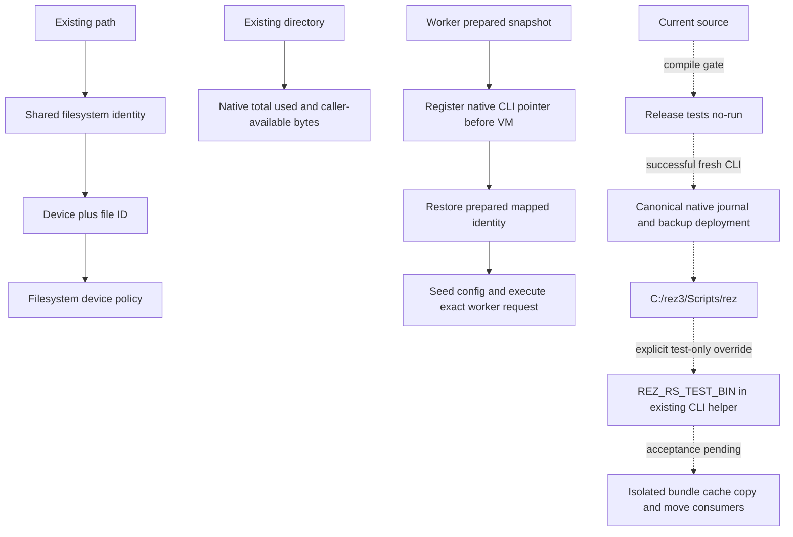

Bootstrap package recipes remain user-run. Agent fixture/deployment checks do not establish full pipeline installation, and typed cache/device source alone does not establish cache execution integration.

## Workspace Build and Package Scope

The full Windows default-feature release workspace build completed with exit 0 in 2387.9 seconds, including ELF and Mach-O patch crates, without compiler warnings/errors. No new tests, installations, or dist refresh accompanied this gate.

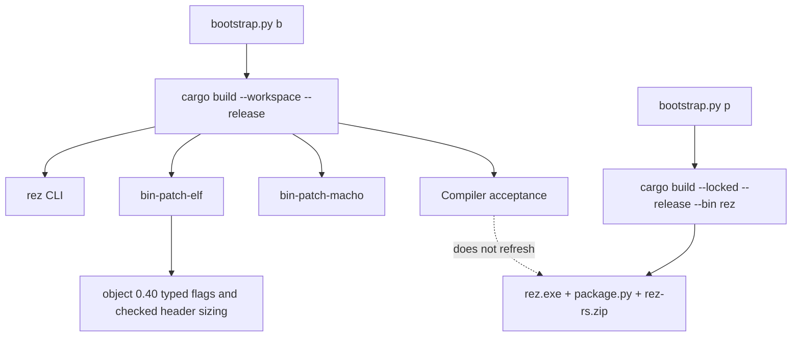

## Native CLI Deployment

Source implementation: `src/cli/admin/deploy.rs`, `src/main.rs`, `cli_install.py`. Release compilation and scoped native help/dry-run/owned temporary activation/idempotence/no-journal recovery/foreign-alias refusal pass on the recorded executable. Bounded schema-2 recovery, ZIP retention/manual-primary refresh and actual Python facade delegation also pass on the earlier accepted executable in owned temporary directories. Fresh CLI/dist and complete installer replay remain separate; see plan30.

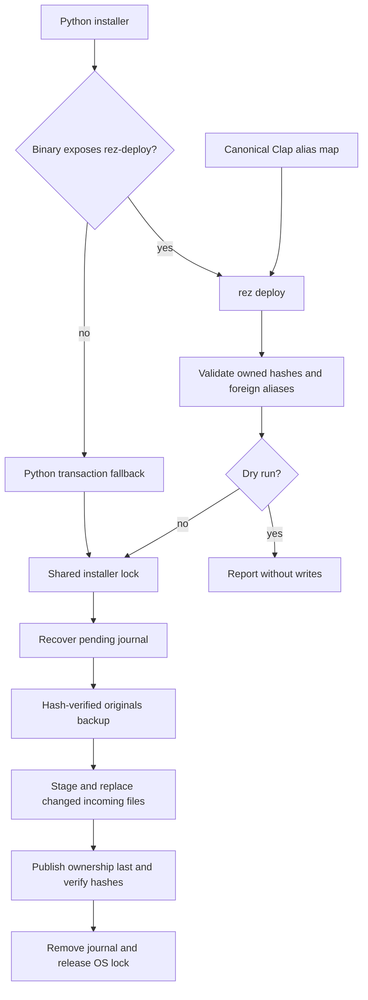

Omitted owned source archives survive alias refresh. An unchanged running primary is not replaced. Native binding uses the separate repository publisher/version lock and advertises metadata only after all selected payloads are prepared.

## Repository Lock Lifecycle

Source: `src/repository.rs:2652,2670,2702,2711,2974`. File presence is separate from OS lock ownership; retaining the file keeps existing waiters and later writers on the same coordination object.

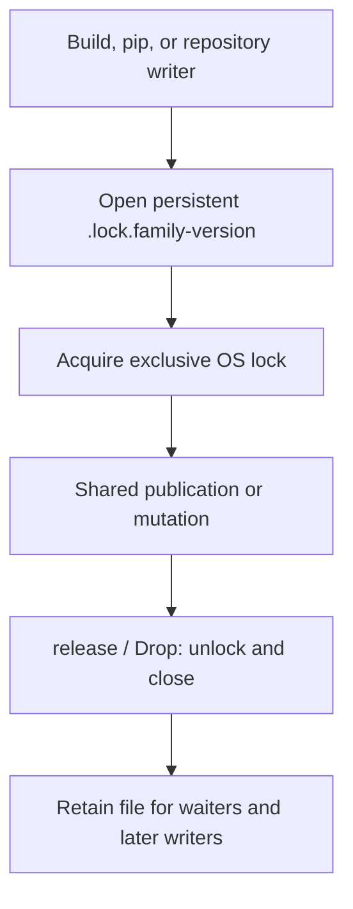

## Historical Recovery Integration

The integration diagram retains the recovery checkpoint. The archived audit ledger (historical snapshot in old.rez-rs) and plan20 (historical snapshot in old.rez-rs) retain its exact source and gate evidence. Solid edges show inspected wiring; dashed edges mark further semantic/runtime acceptance. Current dispositions are consolidated in plan30.

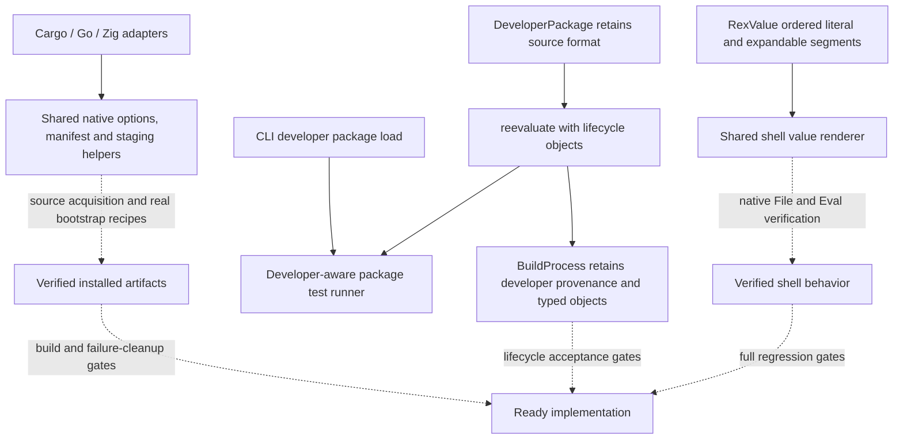

Earlier test/Clippy counts are archived evidence, not current-tree acceptance. The remaining lifecycle, provenance, native recipe, and artifact tasks are consolidated in plan30.

## Embedded Python Runtime Portability

The dependency configuration embeds the RustPython standard library for all existing `init_stdlib` entry points. The preceding release gate passed copied-release Python/SSL probes and exact 1379-source-entry comparison for its recorded snapshot. Current native Python/SRE/source/report changes require a new release, refreshed packaging and repeated artifact verification. Bootstrap117/global deployment and complete Rez compatibility remain open.

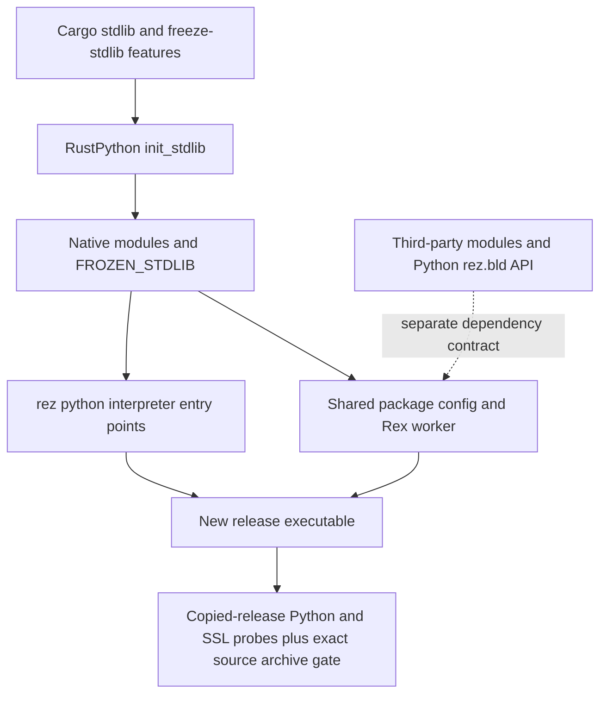

The prior dynamic stdlib branch used build-time filesystem paths. Freezing addresses that common runtime dependency without requiring a home-path override. It does not change already copied binaries or bundle external Python APIs.

## Native Python Re-entry and SRE Acceptance

plan21 (historical snapshot in old.rez-rs) records bounded Python/stub-driver, 24 compiled platform and isolated installer/profile/recovery passes. Full PBS and real bootstrap deployment remain separate. [SRE](docs/mdbook/src/rustpython-sre-history.md) and [VM](crates/rustpython-vm/PATCHES.md) patches share the released dependency boundary; combined 1236-case embedded acceptance passes on native Windows debug. The latest full no-default gate passes all eleven re-entry tests and two portability tests. Current release/deployment and embedded TLS framing remain open.

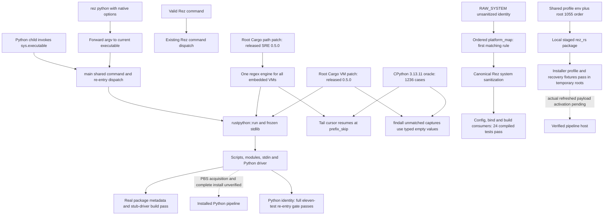

The old release disagrees on 200 oracle cases; its baseline script inverted the assertion to count failures. No pattern anchoring/rewrite or per-package Python command workaround implements this fix.


## Embedded Python TLS Record Boundary

The full no-default gate does not close the independently localized PBS transport stall. The diagnostic framing wrapper reads the same 3,749,438-byte body in 3.391 seconds; the isolated production stdlib fix has no compiled acceptance yet.

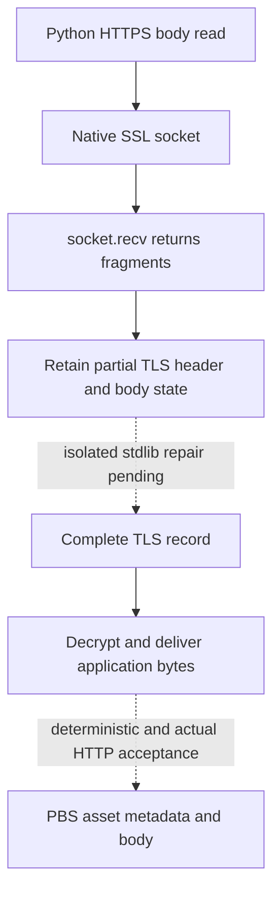

## Resolve to Shell

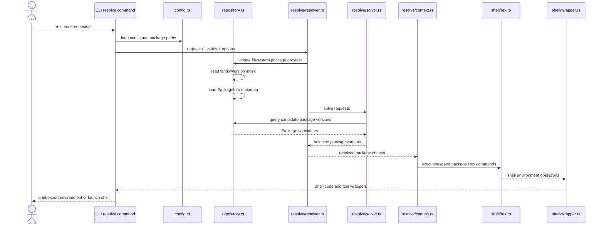

## Repository Path and Package-Component Validation

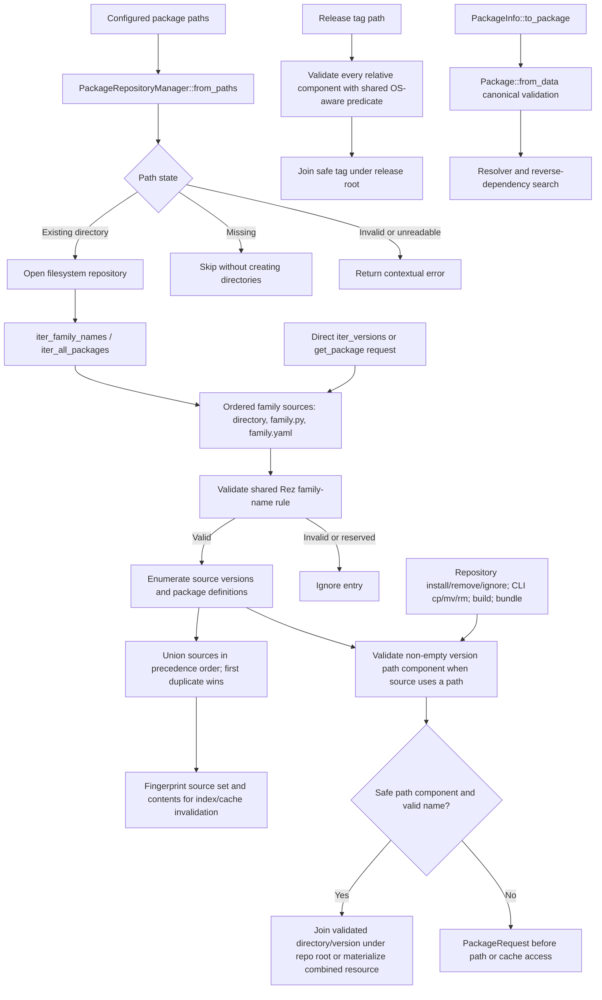

The name rule comes from vendored `formatting.py:20-54`. Versions must parse
as Rez versions; filesystem components must also be safe on the current OS.
On Windows the shared predicate rejects alternate data stream colons, reserved
characters, trailing dots/spaces, and device names. Read-only search paths skip
missing roots and return errors for invalid roots or failed scans. Writes, builds,
bundles, releases, and removals validate before I/O. rez-rs also enumerates root-level
combined-family files (`family.py` and `family.yaml`). Directory families take precedence,
followed by `family.py` and `family.yaml`; version lists are unioned in source order, and
the first source wins for duplicate family/version identities.

## Package Candidate Lookup and Error Semantics

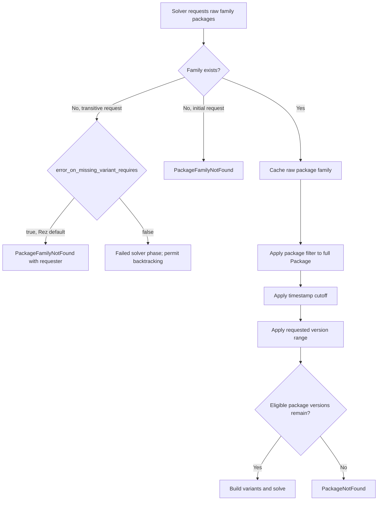

The provider lookup stays raw; candidate filters run after family presence is known. This preserves the difference between an absent family and an existing family with no range-, timestamp-, or filter-eligible versions.

## Build and Release Install Layout

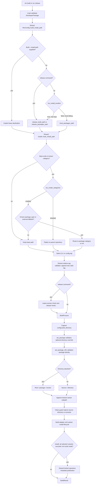

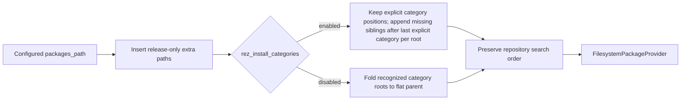

Location selects the real configured repository or user-local debug repository for build installation. Release always selects the real repository through the same destination resolver's explicit release argument, matching the customized source. Build --install-path overrides location selection. Category layout routes before tags, version checks, and hooks. Default local paths use ~/.rez/packages/local/int; release_build_path defaults to None and falls back to release_packages_path. Non-category roots retain their configured paths. Search normalization preserves explicit repository priority and appends only missing category siblings. Routing, scratch-directory, range and common metadata-publication repairs are recorded in plan17.md (historical snapshot in old.rez-rs): 1042 library tests, 32 process CLI tests with repository metadata loading, and strict default-GUI all-target Clippy pass. BuildProcess invokes the shared locked repository publisher only after all selected installed variants succeed. Atomic tests and repeated concurrent-writer checks pass. The CLI checkpoint precedes latest bind changes. New clean-environment work is tracked separately in plan18.md (historical snapshot in old.rez-rs); native adapters and the broader extension queue remain open.

## Clean Shell Environment and Shared OS Baseline

The source audit and checks are in plan18.md (historical snapshot in old.rez-rs). This implemented slice passes 1062 library and 35 CLI tests plus both strict Clippy configurations. The broader structured Rex/rendering migration remains open in plan19.md (historical snapshot in old.rez-rs).

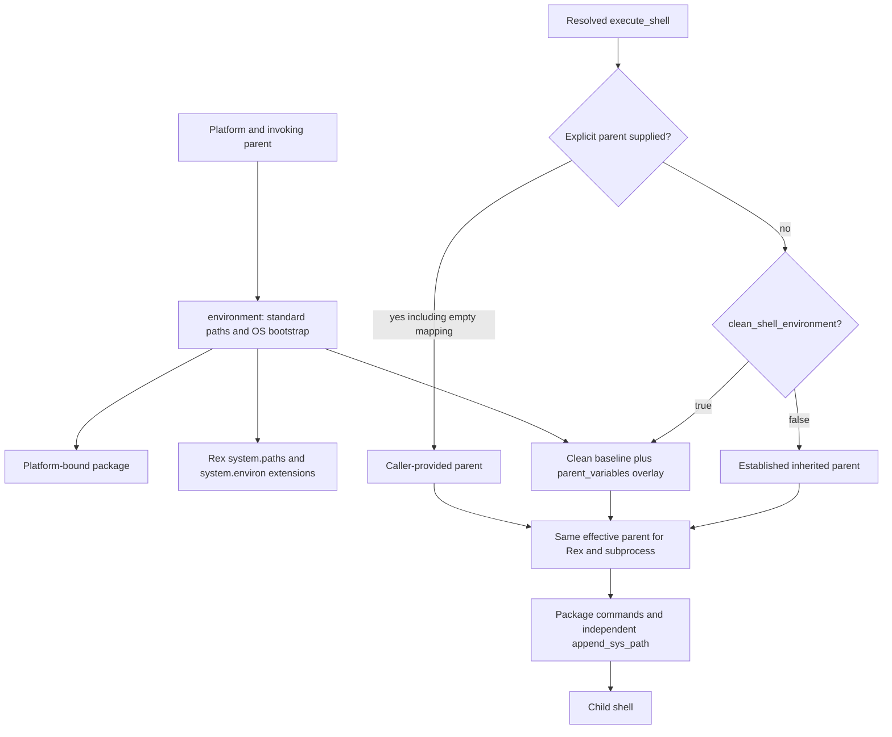

clean_shell_environment defaults to false and uses REZ_CLEAN_SHELL_ENVIRONMENT. parent_variables overlays last; Windows lookup is case-insensitive. Explicitly allowlisted private variables retain their values without hardcoded customized aliases. system.environ is the shared OS/bootstrap mapping; system.paths is its ordered executable-path list. These Rex fields extend rez-rs and are absent from the inspected Python System. The clean flag does not change direct execute_command or native build-child contracts. CONFIG.append_sys_path feeds newly created contexts independently; loaded .rxt values remain historical. Generated platform package commands need the new Rex fields and cannot run directly under unmodified Python Rez without a bridge/alternative definition. Actual Windows Cmd execution is verified; Linux/macOS native shell execution remains unverified.

## Studio Baseline Deployment

The historical plan30 checkpoint (historical snapshot in old.rez-rs) separates configuration, binding, migration, and runtime acceptance. Existing installed package presence alone does not prove that its commands contain the shared baseline.

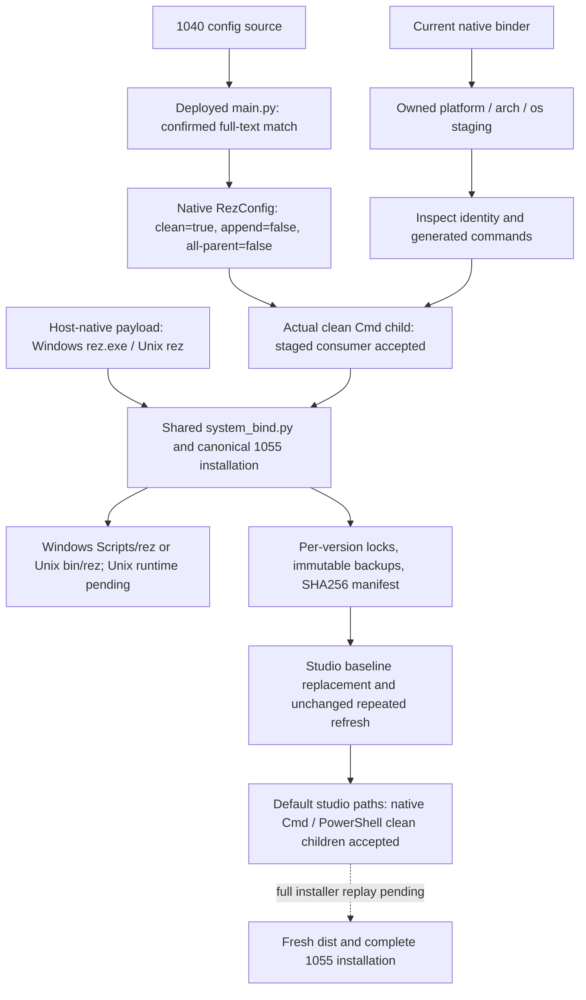

## CLI Argument and Command Dataflow

```mermaid
flowchart LR
    A[argv] --> B[Cli parser in main.rs]
    B --> C[Global process verbosity -v]
    B --> D[Optional global logging target --log]
    B --> E[Commands subcommand enum]
    E --> F[Command-specific Args in src/cli]
    F --> G[run args handler]
    H[search -l] --> I[SearchArgs latest]
    J[test -l] --> K[TestArgs list]
    L[build --variants] --> M[BuildArgs variant selection]
    N[cli_integration tests] --> O[all non-GUI subcommand --help checks]
    N --> P[search -l fixture behavior]
```

Global options belong to the process parser. Short options that have established Rez command meanings remain with the corresponding subcommand.

## Package Definition Discovery and Dataflow

```mermaid
flowchart TD
    A[RezConfig plugins.package_repository.filesystem.package_filenames] --> B[Ordered filename stems]
    B --> C{For each stem in order}
    C --> D[Probe .py, then .yaml, then additive .toml, then additive .yml]
    D -->|first existing file| E[Retain exact source path]
    D -->|none found| X[PackageNotFound]
    E --> F{Detected format}
    F -->|.py| G[RustPython package execution]
    F -->|.yaml or .yml| H[YAML document parser]
    F -->|.toml| I[TOML document parser]
    G --> J[validate_package_data]
    H --> J
    I --> J
    J --> K[Package::from_data]
    K --> L[DeveloperPackage / repository package]
    L --> M[Repository / resolver]
    L --> N[Build / test / release]
    L --> O[Copy / move operations]
    P[Package::from_json API] --> K
    Q[package.json] --> R[Node.js / Bun build detection]
    S[rez bind] --> T[Bind registry -> AppDef and filesystem detector]
    T --> U[Generated package.py and tool links]
```

## Package Load, Attribute Preservation, and Validated Writes

```mermaid
flowchart TD
    A[Configured package filename stems] --> B[Find first package definition]
    B --> C{File format}
    C -->|Python| D[Execute in RustPython with scoped build Python paths]
    C -->|YAML / YML| E[Parse YAML]
    C -->|TOML| F[Parse TOML]
    D --> G[validate_package_data]
    E --> G
    F --> G
    G --> H[Package::from_data]
    H --> I[Typed normalized fields]
    H --> J[Full attributes map retains custom extensions]
    I --> K[DeveloperPackage / PackageInfo]
    J --> K
    K --> L[Repository, resolver, build, test, release]

    M[Package output data] --> N[Remove top-level null values]
    N --> O[validate_package_data]
    O --> P[Apply skip_attributes + preferred key order]
    P --> Q[Serialize YAML / TOML]
    Q --> R[Atomic file write]
```

The writer validates the same package schema as `Package::from_data`, matching vendored Rez's ordering: omit top-level `None`, validate, apply skipped attributes, then serialize. The in-memory `Package.attributes` map retains both known source values and arbitrary extension data while typed fields serve normalized access.

```mermaid
sequenceDiagram
    participant Loader as serialise.rs
    participant VM as python_vm.rs
    participant Package as package/core.rs
    participant Context as resolve/context.rs
    Loader->>VM: execute package source + scoped build Python paths
    VM->>VM: restore sys.path after execution
    Loader->>Loader: evaluate @early with this and public get_objects helper
    Note over Loader: Current production object map is empty
    Loader->>Package: validate and construct Package
    Package->>Context: evaluate late fields; propagate evaluation errors
```

Upstream deferred `@include` modules, package preprocessors, and `DeveloperPackage` build-time reevaluation still require source metadata and provenance through package-copy/build flows; they are not implied by the currently supported `include(name)` extension.

## GUI Context File Load

```mermaid
flowchart LR
    A[rez gui optional .rxt path] --> B[ResolvedContext::load]
    B --> C{Load succeeds?}
    C -->|No| D[SolveResult includes path and error]
    C -->|Yes| E{Resolved status}
    E -->|Failed / aborted| F[Show failure_description or status]
    E -->|Solved| G[Extract packages and tools]
    G --> H[Evaluate and sort environment]
    H --> I[Render existing context result pane]
    G --> I
    D --> I
```

The file loader and error rendering are unit-tested. The graphical eframe/WGPU runtime itself remains unverified on a desktop host.

## Filesystem Repository Source Union and Cache Provenance

```mermaid
flowchart TD
    A[Configured repository root] --> B[Family source discovery]
    B --> C[Directory family]
    B --> D[Root family.py]
    B --> E[Root family.yaml]
    C --> F[package_versions_for_source]
    D --> F
    E --> F
    F --> G[Version list in native source order]
    F --> H[Combined resource versions]
    H --> I[Apply matching version_overrides in declaration order]
    I --> J[Shallow top-level replacement]
    G --> K[Ordered source union]
    J --> K
    K --> L{Duplicate family/version?}
    L -->|Yes| M[First source wins]
    L -->|No| N[Keep package]
    M --> O[PackageInfo + PackageSource kind/path]
    N --> O
    O --> P[Package cache / memcache payload retains source]
    O --> Q[Resolver candidate retains source]
    R[Root or family directory entries change, even if mtime is restored] --> S[Sorted child stat and package-definition fingerprints]
    T[Package-definition content changes] --> U[Content hash fingerprint]
    S --> V[Invalidate RepoIndex, family-name and version caches]
    U --> W[Invalidate package and memcache entries]
    V --> K
    W --> O
```

A family keeps source precedence and each source's native order. Combined-family version lists preserve their declaration order. `.py` precedes `.yaml` among combined sources; configured directory families have higher precedence. Matching version overrides apply as Rez's ordered shallow mapping update.

## Rez `.rxt` ResourceHandle Save and Load

```mermaid
sequenceDiagram
    participant Context as resolve/context.rs
    participant Solver as resolve/solver.rs
    participant Repo as repository.rs
    participant File as `.rxt` JSON or YAML
    participant Decoder as JSON/YAML decoder

    Context->>Context: write serialize_version 4.9 and validate complete context schema
    Context->>Solver: selected package + retained source provenance
    Solver->>Solver: encode filesystem.variant or filesystem.variant.combined handle
    Solver-->>Context: typed ResourceHandle
    Context->>File: write requests, status, package handles and context fields
    File->>Decoder: inspect leading content and parse JSON or YAML
    Decoder-->>Context: shared serde_json::Value
    Context->>Context: validate required typed fields and serialize_version
    Context->>Solver: decode handle and validate handle variables
    Solver->>Repo: resolve exact repository/name/version/source/variant index
    Repo-->>Solver: materialized canonical package
    Solver-->>Context: resolved package with provenance
    Context->>Context: construct ResolvedContext only after schema validation
```

The writer emits serialization version 4.9. The reader accepts JSON and YAML by content, applies the same absent-field defaults for Rez 4.0 through 4.9, and rejects newer versions. Pre-4.0 handles need path-aware conversion and remain unsupported; bundle-specific location fixups and plugin repository handles also remain outside the verified contract. A Python Rez 3.3.0 context saved through the public API is covered by a Rust load regression, including filter/orderer PODs and package_cache_async. Nested `per_family` orderers dispatch by family and round-trip through the context codec. Rust-to-Python loading remains unverified.

Rez package metadata formats are Python and YAML. TOML and `.yml` are rez-rs additions; JSON is accepted by an in-memory API, while `package.json` belongs to Node.js/Bun projects.

## Test Execution and Variant Dataflow

```mermaid
sequenceDiagram
    actor User
    participant CLI as cli/dev/test.rs
    participant Loader as package/discover.rs
    participant Runner as package/test.rs
    participant Resolver as resolve/context.rs
    participant Shell as test subprocess
    User->>CLI: rez test [package] [options]
    CLI->>CLI: Resolve search paths and validate option combinations
    CLI->>Loader: Load complete developer or repository Package
    CLI->>Runner: Package + paths + extra packages + test options
    Runner->>Runner: Select test stage and package variants
    Runner->>Resolver: Resolve package, test, extra, and variant requirements
    Resolver-->>Runner: Resolved test context
    Runner->>Shell: Execute command with resolved environment (current cwd)
    Shell-->>Runner: Exit status and captured output
    Runner-->>CLI: Per-test results
    CLI-->>User: Summary and failure status
```

## Resolver Cache and Build Path

```mermaid
flowchart LR
    A[Resolve requests and options] --> B{Cache identity complete?}
    B -->|No stable provider fingerprint or unsupported callback/filter| D[Run solver without persistent result reuse]
    B -->|Yes| C[Versioned key includes semantic inputs and provider identity]
    C --> E{Stored full key matches?}
    E -->|No| D
    E -->|Yes| F[Use cached result]
    D --> G[Store only with same stable provider identity]
    G --> H[ResolvedContext]

    I[BuildProcess configured or package build_directory] --> BDir{Absolute directory?}
    BDir -->|yes| BAbs[Directory / package / version]
    BDir -->|no| BRel[Source / directory]
    BAbs --> J[Variant subpath]
    BRel --> J
    J --> K[Build path: selected scratch base + variant path]
    J --> L[Install path: package/version root + variant path]
    K --> M[BuildContext and environment]
    L --> M
    M --> N[Builder adapter]
    N --> O[Variant-specific BuildResult]
```

## Audit Hotspots

```mermaid
flowchart TB
    subgraph Resolve
      R1[Repo index and package loading]
      R2[Resolver cache key]
      R3[Solver timestamp and selection mode]
      R4[Requirement Eq and Hash]
    end
    subgraph Build
      B1[Build-system detection]
      B2[Variant install layout]
      B3[Release package metadata]
      B4[Test package and environment resolution]
    end
    subgraph ShellAndData
      S1[Shell-specific wrapper syntax]
      S2[GUI shell-value quoting]
      S3[Environment path-list parsing]
      S4[Lossless format conversion]
    end
    R1 --> R2
    R2 --> R3
    R3 --> R4
    B1 --> B2
    B2 --> B3
    B3 --> B4
    S1 --> S2
    S2 --> S3
    S3 --> S4
```

## GUI Dependency Graph with nodes-rs

```mermaid
flowchart TD
    A[rez gui] --> B[eframe WGPU renderer]
    B --> C[CreationContext WGPU RenderState]
    A --> D[Storage::scan]
    D --> E[GuiPackage by qualified name and family]
    E --> F[Package selection and graph depth]
    F --> G[NodeGraphState::rebuild]
    G --> H[BFS over package requirements]
    H --> I[Storage::latest with Rez VersionRange]
    I --> J[Thread-safe PackageNodeDef strings]
    J --> K[RezPackageNodes implements NodeLibrary]
    K --> L[NodeTypeRegistry and Subnet]
    L --> M[Package nodes and dependency connections]
    M --> N[auto_layout_subnet]
    N --> O[EditorWidget::with_subnet_bare]
    C --> O
    O --> P[EditorWidget::ui]
    P --> R{Structural edit?}
    R -->|yes| G
    R -->|no| Q[EditorPersist saved in GUI preferences]
    D -->|refresh| G
```

Selection originates in `AppState` and is read by the graph view. `Storage::latest` is the shared semantic version selection path used for every dependency edge. Package descriptor strings implement the external library boundary; cached `GuiPackage` and `Requirement` values remain outside the `Send + Sync` node library. Structural edits reported by `EditorResponse` rebuild the derived graph while retaining editor view state; node movement is not treated as a structural edit.


## Package Version Ordering and Rez POD

```mermaid
flowchart TD
    A[Resolver candidate versions for a package family] --> B{PackageOrderList selector}
    B -->|Exact family| C[Selected orderer]
    B -->|No exact match, wildcard exists| C
    B -->|No selector| D[Default version descending]
    C --> E{Orderer type}
    E -->|per_family| F{Nested exact family orderer?}
    F -->|Yes| G[Apply nested orderer]
    F -->|No| H[Apply nested default_order]
    E -->|Other built-in| I[Apply built-in orderer]
    J[Rez per_family POD] --> K[Require orderers list]
    K --> L[Derive dispatch names from each nested packages list]
    L --> F
    M[Unknown outer per_family packages] -. ignored by Rez .-> N[Not part of dispatch or serialized output]
```

`per_family.default_order` is reached by the runtime only after the top-level orderer list selects that `PerFamilyPackageOrder`; for unlisted family names this requires `*` to be an explicit nested family key (usually supplied in a nested orderer's `packages` list). Nested `packages` entries are the authoritative dispatch names. Rust ignores an unknown outer `per_family.packages` key, matching Rez's `from_pod`/`to_pod` behavior.

## Package Test Execution

```mermaid
sequenceDiagram
    participant CLI as rez test CLI
    participant Runner as PackageTestRunner
    participant Resolver
    participant Context as ResolvedContext
    participant Shell as Configured Shell
    CLI->>Runner: run_tests(run_on)
    Runner->>Runner: parse static Package.tests
    loop each selected test
        Runner->>Runner: apply run_on and stop_on_fail
        alt on_variants is false and not inplace
            Runner->>Resolver: resolve common package/test/extra requirements
            alt resolution succeeds and names an available package variant
                Resolver-->>Runner: preferred variant index
                Runner->>Runner: constrain targets to that variant
            else resolution fails or finds no target variant
                Runner->>Runner: retain variant fallback list
            end
        end
        loop target variants
            Runner->>Resolver: resolve package + test + extra + variant requirements
            alt context succeeds and contains the requested variant
                Resolver-->>Runner: ResolvedContext
                Runner->>Context: execute Rex callback and shell command
                Context->>Context: create unique temporary context script
                Context->>Shell: source context and execute command
                Shell-->>Context: exit code, stdout, stderr
                Context->>Context: remove temporary files on drop
                Context-->>Runner: TestResult
            else skipped or failed resolution
                Resolver-->>Runner: skip/error result
            end
        end
    end
    Runner-->>CLI: aggregate results and summary
```

The `on_variants` common-resolution prepass follows Rez's preferred-variant behavior; failed pre-resolution falls back to variant iteration. The package-source lifecycle still limits Rust to static test definitions and package-level `pre_test_commands`.

## Resolver Loaded-Package Metric

```mermaid
flowchart TD
    A[Resolver cold resolve] --> B[Solver initial phase]
    B --> C[VariantCache loads family candidates]
    C --> D[Package filter and timestamp]
    D --> E[Cache eligible versions separately from variants]
    E --> F[Requested VersionRange]
    F --> G[Unique family/version set]
    G --> H[Variant expansion and solve]
    H --> I[Carry set through phase rebuilds and backtracking]
    I --> J[Resolver metric on success or solver error]
    J --> K[ResolvedContext and .rxt]
    L[Resolver cache hit] --> M[Skip solver; current-run metric stays zero]
    N[Loaded .rxt with missing count] --> O[Rez-compatible unknown value -1]
```

Rez 3.3.0's `package_load_callback` runs after requested-range and package-filter checks and before variant expansion (`upstream Rez 3.3.0, src/rez/solver.py:501-529`). Rust counts unique eligible `(family, version)` entries across requests and retries. This matches the observable metric; eager candidate materialization and asynchronous cache behavior remain separate implementation differences.


## Resolved-Context Tools, Suite, and Rex Error Flow

```mermaid
flowchart TD
    A[Suite .rxt path] --> B[Read text]
    B --> C[Parse JSON or YAML value]
    C --> D{Top-level tools array?}
    D -- yes --> E[Return legacy metadata tools]
    D -- no --> F[ResolvedContext::load]
    F --> G[get_tools request_only true]
    G --> H[Require successful context]
    H --> I[Filter to non-conflict direct requests]
    I --> J[Load package data and resolve late tools]
    J --> K[Scan bin and venv executable directories]
    K --> L[Deduplicate tools per package and variant]
    L --> M[Return tools and conflict map]
    M --> N[Suite aliases and conflict handling]
    O[GUI and status callers] --> P[get_tools_with_conflicts false]
    P --> H
    Q[Context Rex execution] --> R[RustPython worker]
    R --> S{Python result}
    S -- success --> T[Continue environment or context operation]
    S -- error --> U[Propagate Rex error]
```

Suite derives request-only tools as in Rez 3.3.0. GUI and status intentionally inspect the complete resolved context. Status obtains tools and provider conflicts from one snapshot so late-bound metadata is evaluated once per report.

## Bind Dependency and Version-Range Flow

```mermaid
flowchart TD
    A[rez bind PKG requirement] --> B[CLI parse Requirement]
    B --> C{Conflict requirement?}
    C -- yes --> X[Return bind error]
    C -- no --> D[bind_package with name and range]
    D --> E[Pending request stack]
    E --> F[Visited module plus range guard]
    F --> G[Bind registry and detection]
    G --> H[BindInfo dependencies and variants]
    H --> I[Parse Requirement values]
    I --> J[Drop conflict dependencies]
    J --> K[Keep dependency version ranges]
    K --> L[Filter detected versions]
    L --> M[Write package artifacts]
    M --> N[Deduplicate paths by package and version]
    N --> O[Return bound package paths]
    H --> P{no_deps?}
    P -- yes --> M
    P -- no --> E
```

`bind_all` uses the same orchestration with dependency traversal disabled. The CLI `--quickstart` supplies the Rez standard module list and disables dependencies for each explicit item.

## Download and Extraction Flow

```mermaid
flowchart TD
    A[BuildProcess selects extraction builder] --> B[Load config downloads or sources.yaml]
    B --> C[Parse url, path, file_name]
    C --> D{Local path resolves?}
    D -- yes --> E[Use local archive]
    D -- no --> F[Derive and validate URL basename]
    F --> G[SHA256 URL cache namespace]
    G --> H{Completed cache exists?}
    H -- yes and checksum valid --> I[Reuse cached archive]
    H -- no --> J[Open .part or resume offset]
    J --> K[HTTP GET, optionally Range]
    K --> L{Response accepted?}
    L -- no --> M[Keep incomplete file or clear rejected range]
    L -- yes --> N[Validate body length and Content-Range]
    N --> O{Checksum configured?}
    O -- yes --> P[Verify completed partial checksum]
    O -- no --> Q[Skip checksum]
    P --> R[Rename .part to final cache file]
    Q --> R
    I --> S[Classify archive extension]
    R --> S
    E --> S
    S --> T{Archive format}
    T -- ZIP --> U[zip::ZipArchive safe extract]
    T -- tar --> V[tar unpack]
    T -- tar.gz / tgz --> W[Gzip decoder then tar unpack]
    T -- tar.xz --> X[XZ decoder then tar unpack]
    U --> Y[Merge staging tree into install]
    V --> Y
    W --> Y
    X --> Y
```

The downloader writes completed files by rename so an HTTP body error cannot appear as a valid cached archive. Current open checks: concurrent cache writers, checksum metadata propagation from extraction source configuration, and platform-specific install semantics; see `docs/plans/plan30.md`, section A5.

## Resolver Persistent Cache Key

```mermaid
flowchart TD
    A[Resolver::resolve] --> B{resolve_caching enabled?}
    B -- no --> H[Run Solver]
    B -- yes --> C{Stable provider identity available?}
    C -- no --> H
    C -- yes --> D{All semantic inputs represented?}
    D -- no --> H
    D -- yes --> E[Build resolver cache v3 key]
    E --> F[Requests, paths, build mode, timestamp, variant mode]
    E --> G[Missing-variant policy and provider identity]
    F --> I[Read cache]
    G --> I
    I --> J{Entry exists?}
    J -- yes --> K[Return cached solve]
    J -- no --> H
```

The v3 key includes `CONFIG.error_on_missing_variant_requires`; unsupported filters, orderers, callbacks, or provider identities bypass persistent caching. See `src/resolve/resolver.rs:397-470`.

## Build CLI Argument Flow

```mermaid
flowchart TD
    A[rez build command options] --> B[Clap captures tokens after --]
    B --> C[Split groups at separator]
    C --> D[First group: build_args]
    C --> E[Second group: child_build_args]
    D --> F{Named and positional values conflict?}
    E --> F
    F -- yes --> G[Return duplicate-input error]
    F -- no --> H[BuildProcess]
    H --> I[Selected adapter receives its argument vector]
```

The first and second argument groups follow Rez's build and child-build contract. The CLI also supports named argument options; supplying both forms for the same group returns an error.

## Python Package Data Cache and Conversion

```mermaid
flowchart TD
    A[Repository package load] --> B[Canonical serialise loader]
    B --> C[Parsed cache enabled]
    C --> D[Key uses path and source contents]
    D --> E[Execute Python with configured build import paths]
    F[DeveloperPackage::from_path] --> B
    F --> G[Parsed cache disabled]
    G --> E
    E --> H[Python globals and values]
    H --> I[Recursive JSON conversion]
    I --> J{Any key/value cannot be represented?}
    J -- no --> K[Validated package data]
    J -- yes --> L[Return contextual error; retain no partial success]
```

DeveloperPackage cache bypass matches the upstream loader's explicit cache-disable policy. Python VM conversion errors on surrogate strings instead of silently dropping package globals or mapping entries.

## Python Metadata, Rex, and Custom Bind Failure Paths

```mermaid
flowchart TD
    A[Package definition or Rex source] --> B[RustPython worker]
    B --> C[Collect globals or execute intersects]
    C --> D[Extract Python strings and mapping values]
    D --> E{All values and keys representable?}
    E -- yes --> F[Validated package data or Rex result]
    E -- no --> G[Return contextual Python conversion error]
    C --> H{Rex object conversion}
    H --> I[Try display string, then .version, then ._s]
    I --> J{Conversion succeeded?}
    J -- yes --> F
    J -- no --> G
    K[rez bind <name>] --> L{Configured custom module name?}
    L -- no --> M[Rust builtin and DCC registry]
    L -- yes --> N[Explicit unsupported-Python error]
    M --> O[Detect and write package]
```

Custom names shadow built-ins according to Rez lookup precedence, but the Rust port does not execute the custom Python bind API. Failed Python-to-Rust conversions propagate through package loading and Rex execution; they are not converted into empty metadata or false version-intersection results. See `src/python_vm.rs:110-138,207-215,286-295,690-780` and `src/package/bind/mod.rs:491-505`.

## Standalone Pip Argument Contract

```mermaid
flowchart LR
    A[requirements.txt is a file] --> B[No setup.py or pyproject.toml]
    B --> C[pip install]
    C --> D{install}
    D -- true --> E[--prefix install_path]
    D -- false --> F[active Python environment]
    E --> G[-r requirements.txt]
    F --> G
    G --> H[Append build args]
    H --> I[Run pip]
    I --> J{install}
    J -- true --> K[Rez site-packages/bin/shebang post-processing]
    J -- false --> L[BuildResult without install path]
```

Project roots retain their existing `pip install --prefix .` and `pip install -e .` argument forms. Exact command vectors are unit-tested in `src/builders/pip.rs`.

## Customized Rez Builder and Ecosystem Flow

**User decision — 2026-10-03:** `rez.bld` is the user's private builder extension, not a mandatory original-Rez API target. Its Python namespace/signatures need not be reproduced. Preserve required builder behavior and ecosystem capabilities, derive contracts from actual recipes, and extend existing Rust adapters through shared BuildContext, typed options/artifacts, acquisition and canonical publication. Select a Python compatibility path only for an identified consumer that actually requires it; no blanket bridge is required. Original Rez core Python API obligations and the observed external-CPython `rez.cli._main` import failure remain separate. Standalone ecosystem dispatch also remains a separate contract. This changes the required interface scope, not acceptance of existing builders.

The Python branches below preserve the customized reference dataflow. The Rust branch implements required capabilities through its shared boundaries; the reference namespace is optional.

~~~mermaid
flowchart TD
    A[Bootstrap profile / deployment-owned inputs] --> B[Rez clean-shell allowlist]
    B --> C[Python Rez CLI]
    C --> D[Python rez.bld API]
    D --> E[Shared source/download/cache helpers]
    E --> F[Python, Rust, CMake, Go, Zig, Bun/TypeScript, pip, archive and studio-specific builders]
    F --> G[Staging]
    G --> H[Transactional install to configured Rez repository]

    C --> I[rez ecosystem command plugins]
    I --> J[Backend registry: Cargo, Go, npm, Bun, Conan, CMake, Make, Nim, Dotnet, Zig, vcpkg, Xcode]
    J --> K[External ecosystem tool]
    K --> L[Staging]
    L --> H

    M[deployment-owned settings schema] --> A
    M --> B
    M --> D
    N[Tool / OS variables: CARGO_HOME, GOPATH, CC, NUGET_PACKAGES, etc.] --> K
    N --> F

    O[rez-rs CLI] --> P[Rust BuildContext adapters]
    P --> Opt[Shared typed options and artifact contracts]
    Opt --> Acq[Shared acquisition and output validation]
    Acq --> G
    P -. selected concrete Python consumer only .-> D
    Q[Python Rez API package] -. historical import dependency .-> D
~~~

~~~mermaid
sequenceDiagram
    participant Profile as customized profile
    participant Rez as Python Rez clean child env
    participant Bld as rez.bld
    participant Tool as External build tool
    participant Repo as Configured package repository

    Profile->>Rez: Supply user-approved Rez-RS extension settings
    Rez->>Rez: Apply explicit environment policy
    Rez->>Bld: Pass documented build inputs
    Bld->>Bld: Validate settings, paths and policy
    Bld->>Tool: Preserve tool-native variables and explicit arguments
    Tool-->>Bld: Build into private staging
    Bld->>Repo: Validate staged output and atomically replace target
~~~

Rez-RS owns the generic extension settings. private-prefixed names identify only the customized source deployment. Toolchain variables retain their upstream names. Build children and resolved interactive shells have separate inheritance contracts.

## Rez Extension Config and Package Category Routing

```mermaid
flowchart TD
    A[Rez-RS extension settings] --> B[REZ_CONFIG_FILE config]
    B --> C[Typed RezConfig]
    D[Package definition] --> E[Package.attributes]
    E --> F{package_type}
    F -->|int / ext / dcc / pip / tool| G[Category]
    F -->|unset + external true| H[ext fallback]
    F -->|unset internal or unknown| I[base path unchanged]
    J{Category switch} -->|enabled| K[Categorized layout]
    J -->|disabled| L[Flat layout]
    M{Build install-location switch} -->|true| N[Real configured repository]
    M -->|false| O[User-local debug repository]
    T[Release command] --> N
    C --> J
    C --> M
    G --> K
    H --> K
    I --> K
    K --> P[Shared build/release destination resolver]
    L --> P
    N --> P
    O --> P
    Q[Build backend: Cargo / Zig / Nim / CMake / Make / uv] --> R[BuildContext + staged artifacts]
    R --> P
    P --> S[Existing BuildProcess install lifecycle]
```

Source behavior is documented in 1040.rez_config/README.md:33-52 and implemented in the customized Python build plugin at 1050.rez_git/src/rezplugins/build_process/local.py:60-100,109-113,142-150. Current rez-rs preserves package_type in Package.attributes and routes both CLI commands through RezConfig::build_install_path and install::route_install_path. Build installation obeys the location switch; release always uses the real repository, matching the verified source contract. The implementation recognizes category suffixes and preserves non-category roots; routing passed the 1019-test library suite and default-GUI all-target compilation. The common installed-metadata publication defect is repaired and verified in the scoped plan17 checkpoint. The additional native backends and staging flow below are planned; see plan16.md (historical snapshot in old.rez-rs) for acceptance criteria.

## Unified Native Application Build Flow

This diagram describes the planned common native build flow; it does not claim that all listed adapters, artifact validation, or transactional publication are implemented.

~~~mermaid
flowchart LR
    A[rez build package] --> B[Typed BuildSpec]
    B --> C[Resolve build requirements and toolchains]
    C --> D{Explicit backend?}
    D -- yes --> E[Selected backend]
    D -- no --> F[Deterministic manifest detection]
    F --> G{Exactly one match?}
    G -- no --> X[Actionable ambiguity or unsupported error]
    G -- yes --> E
    E --> H[Common BuildContext]
    H --> I[Isolated per-variant work directory]
    I --> J[Cargo / Zig / Nim / CMake / Make / uv / other]
    J --> K[Staging output]
    K --> L[Validate artifact manifest]
    L --> M[Shared Rez package layout mapper]
    M --> N[Transactional install into configured repository]
~~~

Backend adapters own tool-specific command construction and output discovery. Shared request validation, environment policy, staging, artifact verification, package layout and install rollback remain centralized.

## Bootstrap117 Current Acceptance Stages

This checkpoint accepts the owned profile cache, platform/arch/OS binding, all five Python 3.10–3.14 payload/direct-runtime probes, one offline pip standards corpus and ten independently hashed compiled publication tests. It does not establish resolved shell, batch joint resolution, fresh release/seed or complete-tree installation. Exact markers, earlier failures and per-operation scope remain in plan23 (historical snapshot in old.rez-rs).

~~~mermaid
flowchart TD
    A[Manifest and owned profile] --> B[Distribution cache accepted]
    B --> C[Platform / arch / OS bound]
    C --> D[Python 3.10–3.14 installed and direct probes accepted]
    D --> E[Resolved Cmd / PowerShell consumer gate pending]
    A --> F[Offline pip standards corpus accepted]
    F --> G[Ten compiled publisher tests accepted]
    G --> H[Real pip / foundation consumer gate pending]
    A --> I[Shared Make / Just planner checks scoped]
    I --> J[Full joint metadata / resolve gate pending]
    E --> K[Fresh release and source package gate pending]
    H --> K
    J --> K
    K --> L[Seed activation and all package execution pending]
~~~

Independent package loads must feed one batch resolver; separate successful loads are not joint-resolve proof. Direct interpreter probes do not prove shell argv/environment transfer. Writer rollback tests do not establish a cross-file atomic snapshot for unlocked readers.

## Native Batch Producer and Scheduler Boundary (source prepared)

The producer and consumer changes below await current gates; see plan24 (historical snapshot in old.rez-rs). A failed joint solve must remain failed and retain its complete requested set. Independent alternatives do not establish that all requirements coexist.

~~~mermaid
flowchart TD
    A[view source-path building JSON] --> B[Canonical DeveloperPackage ordinary load]
    B --> C[Target build_variant building true]
    T[Prospective transitives building false] --> E[Installed-first composite provider]
    C --> D[Build request and strict implicit requirements]
    D --> F[Shared build context and joint Resolver / Solver]
    E --> F
    F --> G[Schema1 mode aliases complete requests exact origins]
    G --> H[Selected source AND prerequisites including self edges]
    H --> I[Strict Windows Disk / UNC path-key and alias consumer]
    I --> J[Scheduler and installed-only revalidation]
    J --> K[CLI parent None or explicit empty]
    K --> L[Full Cmd / PowerShell argv and process gates pending]
~~~

No RXT is saved by batch collection. Full source-frozen tests, no-home portability and external strict-consumer integration remain pending; the initial eleven-case PowerShell pass does not close the failing 180-case corpus.

## PowerShell Completion and CLI Process Outcomes

The forwarding/extraction production report and compile-only evidence are in plan25.md (historical snapshot in old.rez-rs); runtime acceptance of those changes remains pending.

Historical V3/V4 scoped core coverage passed 344 tests. V9 passes both strict all-target Clippy feature gates, but the complete serial no-GUI suite fails with 1370 passed, one TLS deadline failure and two ignored. Current PowerShell integration 5, portability 3 and reentry 11 pass; the TLS phase/cause remains unknown. Source flow is not a claim of complete Rez parity; follow plan24.md (historical snapshot in old.rez-rs) for gate history.

```mermaid
flowchart TD
    C[ResolvedContext noninteractive script] --> E[ShellType exit_command]
    S[Suite WrapperScript generate] --> E
    F[Forward wrapper generation] --> E
    E --> Q[Snapshot PowerShell success before lookup]
    Q --> N[Strict-safe existing native exit lookup]
    N --> P[Preserve native-code priority or command failure]
    P --> X[Script process exit status]
    X --> ENV[Env child status]
    X --> FW[Forward captured child status]
    Y[Non-suite typed YAML function or plugin dispatch] --> PR[Existing Python runner with optional TempPath]
    PR --> PY[Python process status]
    PY --> CLEAN[Drop optional TempPath before conversion]
    CLEAN --> O[Existing OS converter inside command]
    ENV --> O
    FW --> FL[Flush captured stdout and stderr]
    FL --> O
    O --> R[Return Result ExitCode to main]
    R --> M[One normal main dispatch boundary]
    O --> W[Windows code above 255: process exit bypasses main]
```

Source anchors: `src/shell/types.rs:308`; `src/resolve/context.rs:1774-1777`; suite `src/shell/wrapper.rs:280-283`; forward `:374`; normal dispatch `src/main.rs:436,530`; Env `src/cli/resolve/env.rs:173,390`; Forward `src/cli/admin/forward.rs:23,154`; Python dispatch `src/main.rs:526`. The greater-than-255 Windows escape is the established common converter, not a new unsafe/nightly implementation. Conversion occurs inside Env/Forward/Python before returning Result<ExitCode> to main. Forward flushes captured output before conversion; the Windows greater-than-255 escape bypasses normal main dispatch.

Package Rex commands and wrapper forwarding remain on their existing execution paths. The completion policy records $? before lookup so lookup itself cannot overwrite success. The shared native result boundary preserves child codes for Env/Forward/Python while ordinary operational build/test/release errors keep their existing semantics. Non-suite Forward now converts typed YAML arguments and dispatches module functions or plugin targets through the existing Python runner. The runner owns and removes its optional TempPath before the Windows greater-than-255 exit converter. Missing Python Rez APIs propagate and custom YAML tags are rejected; these new production paths await runtime acceptance.

## Owned Pip Publication

Source-only publication contract; fresh compiler/runtime acceptance is pending:

```mermaid
flowchart TD
    S[Original Python definition bytes] --> L[Canonical loader and typed Package]
    L --> V[Verify unchanged bytes identity and complete data snapshot]
    V --> P[Existing publisher version lock and journal]
    P --> W[Atomic original-byte metadata write]
    G[Selected Pip launcher] --> C[AST or selected distlib capability preflight]
    C --> R[Selected Pip parser interpreter and actual runner]
    R --> M[SourceMap identity and owned source graph]
    M --> O[Prepared payload and relocated references]
    O --> P
    W -. pending .-> A[Compiled fixtures and installed consumers]
```


Implemented source flow; platform and performance receipts are scoped in plan27.md (historical snapshot in old.rez-rs).

```mermaid
flowchart TD
    A[Native pip target] --> B[Existing RECORD mapping copy]
    B --> C[Owned per-distribution TempDir]
    C --> D[Shared repository publisher and lock]
    D --> E{Installed and replace false?}
    E -- yes --> F[Skip unused staging and RAII cleanup]
    E -- no --> G[Shared full-tree safety validation]
    G --> H{Payload ownership}
    H -- owned --> I[Rename staging into transaction workspace]
    I -- CrossesDevices --> J[Existing shared copy mode]
    H -- borrowed --> J
    I -- success --> K[Journal and backup existing destinations]
    J --> K
    K --> L[Install selected payload]
    L --> M[Atomic metadata write last]
    L -- error --> N[Rollback journal and restore backups]
    M -- error --> N
    N -- rollback failure --> O[Retain recovery workspace]
```

The ownership optimization removes the publication snapshot copy on one volume. Pip unpacking and its layout-mapping copy remain. This is not whole-bootstrap installation acceptance, a cross-device execution result or a global performance guarantee.

## Pip Identity and Original Bootstrap Recipes

Current accepted source/recipe scope: plan28.md (historical snapshot in old.rez-rs). This flow preserves public Rez family spelling; PEP 503 keys are comparison identities only.

```mermaid
flowchart TD
    A[Pip METADATA and enabled dependencies] --> B[Canonical PEP 503 comparison keys]
    B --> C[Shared repository manager]
    C --> D[Validate matching from_pip packages]
    D --> E{Installed spellings ambiguous?}
    E -- yes --> X[Contextual identity error]
    E -- no --> F[One current-batch and installed spelling table]
    F --> G[Root Package name]
    F --> H[Requirement optional resolved_name]
    G --> I[Shared publication and normal Rez resolve]
    H --> I
    J[Custom build or direct test shell source] --> K[ShellType command]
    K --> L[Cmd raw source or ordinary shell argv]
    L --> M[Original recipe and shared BuildContext]
    M --> I
    I --> N[Installed source and compiled payload reload]
    N --> O[Storage / builder / python_setup joint imports]
    N --> P[Five Python YAML C parser and shotgun imports]
    N --> Q[Qt.py module discovery only]
```

Storage, example.rez_build and python_setup installed successfully from their original recipes. PyYAML 6.0.3 has five installed Python variants; shotgun_api3 3.10.0 and Qt.py 2.0.5 retain variantless recipe metadata. All five normal resolved Python consumers pass YAML C-extension parsing and shotgun imports; Qt uses find_spec without importing a binding. Launcher commands, Qt GUI execution, NumPy's exact 2.5.2/Python 3.14 pin and the empty studio CA remain open. No bootstrap source edits or new full test suite occurred.
